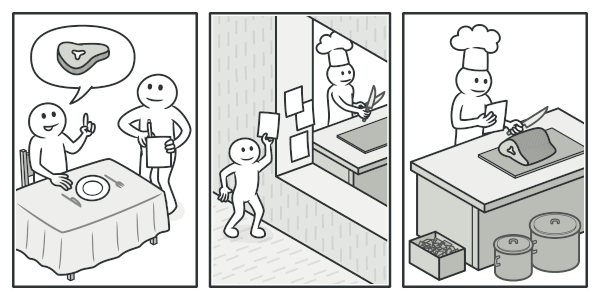
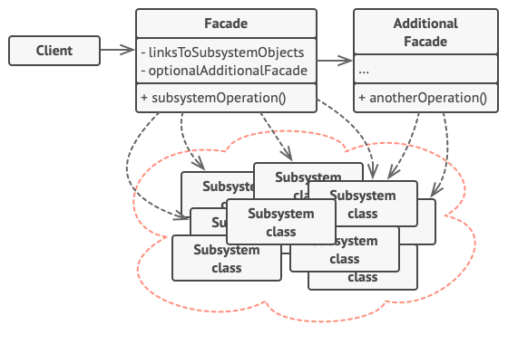

# À connaître !


## Design pattern: définition

- Solution documentée pour des problèmes courrant
- Bonnes pratiques
- Classification:
    - creational patterns (modèle de création)
    - structural patterns (modèle de structuration)
    - behavioral patterns (modèle de comportement)
    - concurrency patterns (modèle de concurrence)

\newpage

# Q1 Singleton

- Creational patterns (modèle de création)
- Classe qui ne pourra avoir qu'une seule instance
- Difficile à implémenter correctement !

## Image


## Diagramme


## Implémentation
```Java

/*package whatever //do not write package name here */
import java.io.*;
class Singleton {
    // static class
    private static Singleton instance;
    private Singleton()
    {
        System.out.println("Singleton is Instantiated.");
    }
    public static Singleton getInstance()
    {
        if (instance == null)
            instance = new Singleton();
        return instance;
    }
    public static void doSomething()
    {
        System.out.println("Somethong is Done.");
    }
}
```
\newpage

# Q2 Abstract factory

- Creational pattern (modèle de création)
- __Fournir une interface unique pour instancier des objets d'une même famille sans avoir à connaître les classes à instancier__
- Crée des "familles" d'objects
    - Permet de facilement changer l'implémentation
    - Permet de facilement remplacer l'implémentation par des mocks

## Intention

Abstract Factory permet de créer des familles d’objets apparentés sans préciser leur classe concrète.

## Image


## Quand utiliser ?

- Un système doit être indépendant de comment ses produits sont créés, composés et représentés
- Un système doit être configuré avec une ou plusieurs familles de produits
- Une famille d'objets produits apparentés est conçue pour être utilisée ensemble, et vous devez faire respecter cette contrainte.
- Vous voulez fournir une bibliothèque de classes de produits, et vous voulez révéler seulement leurs interfaces, pas leurs implémentations.

## Diagramme


## Pseudo code:

```java
\\ For User
interface AbstractFactory;
interface Button;
interface Checkbox;

\\ Our implementation
class Windows implements AbstractFactory;
class Mac implements AbstractFactory;

class WinButton implements Button;
class MacButton implements Button;

class WinCheckbox implements Checkbox;
class MacCheckbox implements Checkbox;
```
\newpage

# Q3 Prototype

- Creational pattern
- Création d'objets à partir d'un prototype
- Permet d'éviter des coûts d'initialisation de structures complexes en copiant et modifiant des prototypes plutôt que de tout faire depuis le début
- Souvent utilisé pour des structures complexes de graphes

## Intention

Prototype crée de nouveaux objets à partir d’objets existants sans rendre le code dépendant de leur classe.

## Images


Copier un objet « depuis l’extérieur » n’est pas toujours possible.

Les prototypes préconstruits sont une alternative au sous-classage.


## Diagramme


\newpage
Autre possibilité


## Implémentation

```java
public abstract class Prototype implements Cloneable {
    public Prototype clone() throws CloneNotSupportedException{
        return (Prototype) super.clone();
    }
}

public class ConcretePrototype1 extends Prototype {
    public Prototype clone() throws CloneNotSupportedException {
        return (ConcretePrototype1) super.clone();
    }
}

public class ConcretePrototype2 extends Prototype {
    public Prototype clone() throws CloneNotSupportedException {
        return (ConcretePrototype2) super.clone();
    }
}
```
\newpage

# Q4 Adapter (or Wrapper)

- Structural pattern
- L’adaptateur permet de faire collaborer des objets ayant des interfaces normalement incompatibles.

## Images


## Diagramme


## Implémentation

```java
interface Shape {
    public double computeArea()
}
public class Rectangle implements Shape {
    public double computeArea() {…}
}
public class Triangle implements Shape {
    public double computeArea() {…}
}
public class Circle {
    public double computeSurface() {…}
}

\\ Here our adapter
public class CircleAdapter implements Shape {
    Circle circle;
    public double computeArea() { return circle.computeSurface() }
}
public class Client {
    public double computeAreaOfShapes() {
        List<Shape> shapes = new ArrayList<>();
        shapes.add(new Rectangle());
        shapes.add(new CircleAdapter(new Circle()));
        shapes.add(new Triangle());
        return shapes.stream().mapToDouble(
        f -> f. computeArea()).sum();
    }
} 
```

## Alternative ?????

\newpage

# Q5 Proxy and Virtual proxy / lazy initialization (Procuration)

- Structural pattern
- Permet d’utiliser un substitut pour un objet. Elle donne le contrôle sur l’objet original, vous permettant d’effectuer des manipulations avant ou après que la demande ne lui parvienne.
- Retarde la création d'un objet jusqu'à ce que celle-ci soit nécessaire

## Image


## Diagramme


 
\newpage

# Q6 Decorator

## Intention

Decorator permet d’affecter dynamiquement de nouveaux comportements à des objets en les plaçant dans des emballeurs qui implémentent ces comportements.

## Images


## Diagramme


## Implementation

```java
public interface ChristmasTree { String decorate(); }
public class ChristmasTreeImpl implements ChristmasTree {
    public String decorate() { return "Christmas tree"; }
}
public abstract class TreeDecorator implements ChristmasTree {
    private ChristmasTree tree;
    public String decorate() { return tree.decorate(); }
}
public class BubbleLights extends TreeDecorator {
    public String decorate() {
        return super.decorate() + " with Bubbleights";
    }
}
public class Garland extends TreeDecorator {
    public String decorate() {
        return super.decorate() + " with Garland";
    }
}
public static void main(String[] args) {
    ChristmasTree tree = new BubbleLights(
        new Garland(new ChristmasTreeImpl()).decorate()
    );
}
```
\newpage

# Q7 Template Method

- Behavior pattern

## Intention

Permet de mettre le squelette d’un algorithme dans la classe mère, mais laisse les sous-classes redéfinir certaines étapes de l’algorithme sans changer sa structure.

## Image


## Diagramme


## Implémentation

```java
static abstract class AbstractBaBaRecipe {
    public void cookBaba() {
        prepareDought();
        prepareChantilly();
        addLiquid();
        putInOven();
    }
    private void prepareDought() {}
    private void putInOven() {}
    protected abstract void addLiquid();
    private void prepareChantilly() {}
}
static class RumBaba extends AbstractBaBaRecipe {
    protected void addLiquid() {
    }
}
static class SyrupBaba extends AbstractBaBaRecipe {
    protected void addLiquid() {}
}
static class VodkaBaba extends AbstractBaBaRecipe {
    protected void addLiquid() {}
}
```
\newpage

# Q8 Flyweight

- Structural pattern

## Intention

Permet de stocker plus d’objets dans la RAM en partageant les états similaires entre de multiples objets, plutôt que de stocker les données dans chaque objet.

## Image


## Diagramme


## Implémentation (TODO !!)

\newpage

# Q9 Command

- Behavior pattern

## Intention

Prend une action à effectuer et la transforme en un objet autonome qui contient tous les détails de cette action.

Cette transformation permet de paramétrer des méthodes avec différentes actions, planifier leur exécution, les mettre dans une file d’attente ou d’annuler des opérations effectuées.

## Image


Analogie


## Diagramme (TODO ???)


## Implémentation (TODO !!!)

\newpage

# Q10 Builder

- Creational pattern

## Intention

Permet de construire des objets complexes étape par étape. Il permet de produire différentes variations ou représentations d’un objet en utilisant le même code de construction.

## Image


## Diagramme


## Implémentation

\newpage

# Q11 Facade

## Intention

procure une interface offrant un accès simplifié à une librairie, un framework ou à n’importe quel ensemble complexe de classes.

## Image(TODOOOOO)


## Diagramme



\newpage

# Q12 Observer

- Behavior pattern

## Intention

Permet de mettre en place un mécanisme de souscription pour envoyer des notifications à plusieurs objets, au sujet d’événements concernant les objets qu’ils observent.

## Image


## Diagramme


## Implémentation (TODO !!)

\newpage

# Q13 State

- Behavior pattern

## Intention

Permet de modifier le comportement d’un objet lorsque son état interne change. L’objet donne l’impression qu’il change de classe.

## Image


## Diagramme


## Implémentation (TODO !!)

\newpage

# Q14 Visitor

- Behavior pattern

## Intention

Permet de séparer les algorithmes et les objets sur lesquels ils opèrent.

## Image


## Diagramme


## Implémentation (TODO !!)
