# Question 15 - Quelles sont les différentes activités du cycle de développement. Sélectionnez l'une d'elles et expliquez-la en détail. A quoi faut-il faire attention.

- Requirements: Détermine les besoins du client
- Design: Définit les spécifications et la structure du logiciel (peut être découpé en high-level design (architecture) et en design détailé)
- Implementation: création du logiciel (code, configuration)
- Testing: évaluer si le logiciel répond aux spécifications et aux attentes du client
- Maintenance: une fois en production, améliorer le logiciel et s'assurer qu'il reste opérationnel
 
# Question 16 – Quels sont les différentes catégories de requirements – Expliquez comment on peut les formaliser. Prenez l’un des formalismes et expliquez-le en détail.

Le besoin qu'une partie prenante cherche à satisfaire.

Attention : TRÈS SOUVENT, on mélange le besoin et la solution pour le satisfaire.

## Catégories de requirements

- Fonctionnel
    - validité
- Non-fonctionnel
    - Performances : scalabilité, débit (throughput)
    - Facilité d'utilisation : facile à comprendre, rapide à utiliser
    - Réutilisation : les éléments peuvent-ils être réutilisés pour d'autres logiciels ?
    - Portabilité : est-il polyvalent du point de vue de la plate-forme ?
    - Interopérabilité : s'intègre-t-il facilement avec des tiers ?
    - Robustesse : Est-il résistant lorsqu'il est confronté à des comportements inattendus ?

## Qualité des requirements

1. Unitaire : les exigences répondent à 1 et 1 seul besoin
2. Complétude : les exigences sont globales
3. Cohérence : les exigences ne vont pas à l'encontre d'autres exigences
4. Traçabilité : l'exigence est correctement documentée et vérifiée.
5. Actualité : les exigences sont à jour. Dans le cas contraire, cela conduit à un glissement du champ d'application.
6. Sans ambiguïté : les exigences sont exemptes de jargon technique et sont suffisamment documentées pour ne pas nécessiter de connaissances supplémentaires pour les interpréter.
7. Priorité : les exigences sont correctement hiérarchisées afin d'optimiser les ressources.
8. Vérifiable : la mise en œuvre de l'exigence peut être vérifiée et il existe un moyen clair de valider si elle a été correctement mise en œuvre.

## Capturer les requirements ?

1. Haut niveau
    - Document vision
    - Learn Canvas
2. Détaillé
    - User stories or use case
        - User storie: As a < type of user >, I want to < some goal > so that <
reason to achieve the goal >
        - use case: Décrit les interactions entre un rôle, c'est-à-dire un acteur, et le système, afin d'atteindre les objectifs fixés.
    - storyboards: Raconter une histoire à l'aide d'une séquence de dessins/croquis/images
    - non-fonctionnel: définit la manière dont le système fonctionne et NON ce qu'il fait. Également appelés attributs de qualité

### requirements non fonctionnels

Execution quality attributes

- security, usability, performance (throughput, response time), fault tolerance, high availability, auditability….

Availability

- Evolution quality attributes
- Maintainability, testability, interoperability, performance (scalability)

# Question 17 – Quels sont les différentes approches de gestion du cycle de développement ? Comparez deux d’entre-elles.
 
- Waterfall
- V-Cycle
- Iterative and Incremental
- Agile

## Waterfall

- Découpage linéaire des activités
- Fonctionne bien dans un environnement très structuré et stable
- Simple à comprendre et à appliquer
- Le développement de logiciels évolue rapidement

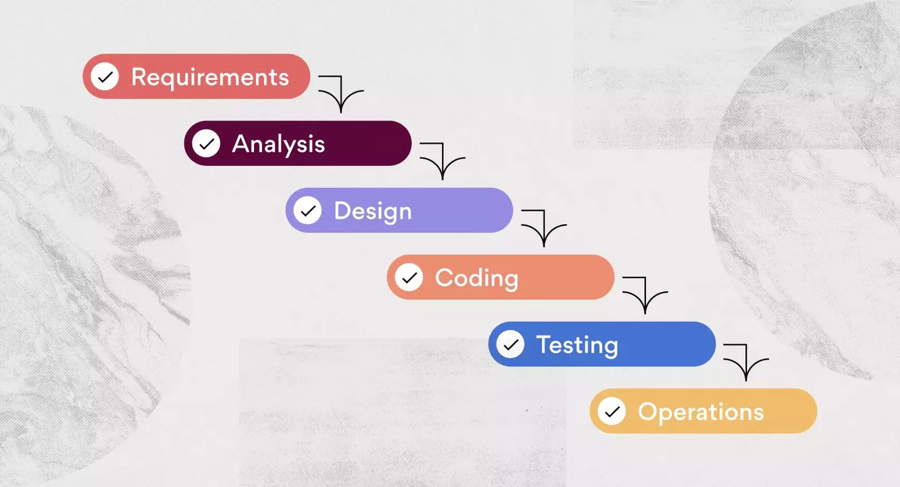

## V-Cycle

- Évolution du modèle waterfall
- Chaque étape du droit correspond à la vérification et la validation de l'étape de gauche.

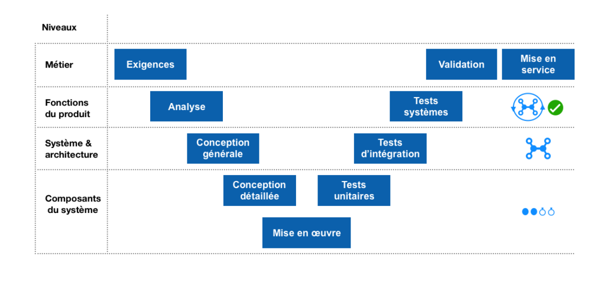

## Iterative and incremental

- Développer un logiciel par le biais de cycles répétés (itératifs) et par petits morceaux (incrémental).
- Le client est impliqué dans chaque étape
- Rational Unified Process est l'implémentation la plus connue.

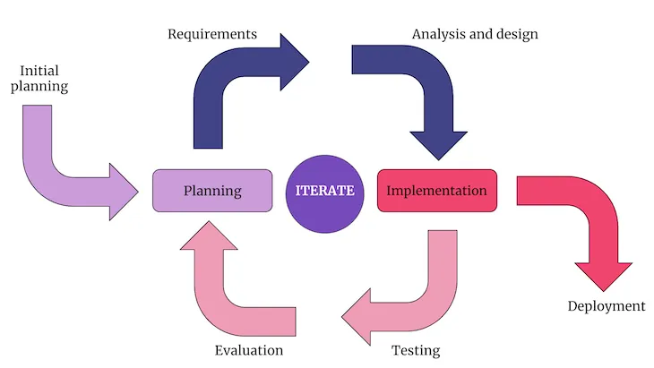{width=70%}

### Rational Unified Process

RUP consiste à donner la priorité à la chose la plus risquée

- Inception : phase la plus courte
- Élaboration : traiter les facteurs de risque connus
- Construction : phase la plus longue, développement
- Transition : obtenir l'avis des utilisateurs

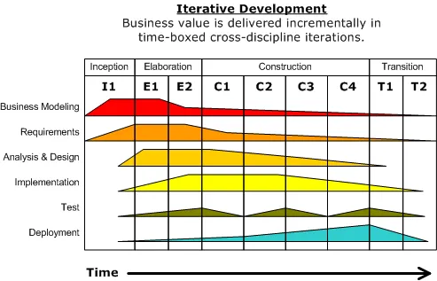

## Agile

Il ne s'agit pas d'un processus de développement mais plutôt d'un état d'esprit

- Les individus et les interactions plutôt que les processus et les outils
- Un logiciel fonctionnel plutôt qu'une documentation complète
- La collaboration avec le client plutôt que la négociation d'un contrat
- Répondre au changement plutôt que suivre un plan

### Manifeste Agile

- Accueillir les exigences changeantes, même à un stade avancé du développement. Les processus agiles exploitent le changement pour l'avantage concurrentiel du client.
- Livrer un logiciel fonctionnel fréquemment, de quelques semaines à quelques mois, avec une préférence pour les délais les plus courts.
- Les commerciaux et les développeurs doivent travailler ensemble quotidiennement tout au long du projet.
- Construire des projets autour d'individus motivés. Donnez-leur l'environnement et le soutien dont ils ont besoin et faites-leur confiance pour faire le travail.
- La méthode la plus efficace pour transmettre des informations à une équipe de développement et au sein de celle-ci est la conversation en face à face.
- Le logiciel fonctionnel est la principale mesure du progrès.
- Les processus agiles favorisent le développement durable. Les commanditaires, les développeurs et les utilisateurs devraient être en mesure de maintenir un rythme constant indéfiniment.
- L'attention constante portée à l'excellence technique et à la qualité de la conception renforce l'agilité.
- La simplicité - l'art de maximiser la quantité de travail non effectué - est essentielle.
- Les meilleures architectures, exigences et conceptions émergent d'équipes auto-organisées.
- À intervalles réguliers, l'équipe réfléchit à la manière de devenir plus efficace, puis ajuste son comportement en conséquence

# Question 18 – Citez 5 principes de software engineering. Comparez deux d’entre-eux.

L'architecture logicielle décrit les éléments constitutifs d'un système logiciel
et leurs relations ainsi que les interactions avec les éléments externes.
L'idée est de projeter les systèmes selon différentes vues pour les décrire.

## The Conway’s Law

Toute organisation qui conçoit un système (défini au sens large) produira une conception dont la structure est une copie de la communication de l'organisation.

## SOLID

### Principe de responsabilité unique (Single-responsibility principle)

- Une classe ne doit avoir qu'une seule responsabilité, c'est-à-dire que seuls les changements apportés à une partie de la spécification du logiciel doivent pouvoir affecter la spécification de la classe.

### Principe d'ouverture et de fermeture (Open–closed principle)

- Les entités logicielles ... doivent être ouvertes à l'extension, mais fermées à la modification.

### Principe de substitution de Liskov

- Les objets d'un programme doivent pouvoir être remplacés par des instances de leurs sous-types sans que cela n'altère la correction du programme.

### Principe de ségrégation des interfaces (Interface segregation principle)

- Plusieurs interfaces spécifiques au client valent mieux qu'une seule interface à usage général.

### Principe d'inversion de la dépendance (Dependency inversion principle)

- Il faut "dépendre des abstractions, [et non] des concrétions".

## YAGNI

Le principe "You aren't gonna need it" (YAGNI) est un principe de la programmation extrême (XP) qui stipule qu'un programmeur ne doit ajouter des fonctionnalités que si elles sont jugées nécessaires.

Le cofondateur de XP, Ron Jeffries, a écrit : "Implémentez toujours les choses lorsque vous en avez réellement besoin, jamais lorsque vous prévoyez qu'elles seront nécessaires".

## KISS

KISS, acronyme de "keep it simple,
stupid" ou "keep it stupid simple", est un
principe de conception énoncé par la marine américaine
américaine en 1960.

Le principe KISS stipule que la plupart des systèmes
fonctionnent mieux s'ils sont simples que s'ils sont compliqués.
Par conséquent, la simplicité doit être un objectif clé de la conception et la complexité inutile doit être évitée.

## Law of Demeter
 
Principe de moindre connaissance (least knowledge)

- Chaque unité ne doit avoir qu'une connaissance limitée des autres unités : seulement les unités "étroitement" liées à l'unité actuelle.
- Chaque unité ne doit parler qu'à ses amis ; ne pas parler à des étrangers.
- Ne parlez qu'à vos amis immédiats.

Le respect de ce principe favorise la maintenabilité, mais s'il est utilisé de manière abusive, il conduit à la création d'un grand nombre de wrappers inutiles.

# Question 19 – Qu’elles sont les étapes de création d’une architecture ?

- Vue logique : il s'agit d'une vue statique ou instantanée du système. (diagramme de classe, diagramme d'état)
- Vue du processus : il s'agit d'une vue dynamique du système, qui décrit le comportement en cours d'exécution (diagramme de séquence, diagramme d'activité).
- Vue du développement : décrit le point de vue de l'équipe de développement, explique comment les composants interagissent et sont assemblés (diagrammes de composants et de paquets)
- Vue physique : comment le système est déployé physiquement sur le matériel
(diagrammes de déploiement)
- Scénarios : donne une compréhension de haut niveau de l'objectif du système (cas d'utilisation)
 
# Question 20-26 Quels sont les patterns d’architecture qui implémentent les tactiques : increase cohesion, reduce coupling, manage resources, defer binding, control demand, locate services

## A quoi sert l’architecture pattern ?

## Faire un diagramme pour expliquer son fonctionnement

## A quoi faut-il faire attentions ?

# Tactics (TODO !!!)

# Question 20 Layered

Le modèle d'architecture en couches définit une séquence de couches.

Chaque composant est associé à exactement à une couche et __aucune couche inférieure ne peut appeler une couche supérieure__.

Le contrat entre chaque couche est clairement défini et il est donc facile de remplacer une couche par une autre.

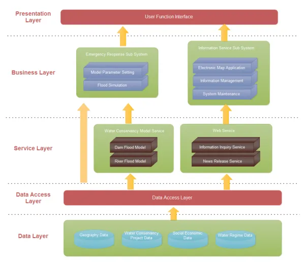{width=70%}

## Propriétés

### Construction

- Au moins 2 layers
- Chaque composante est dans exactement 1 layer
- Aucun layer inférieur peut appeler un layer supérieur

### Attention

- Complexité additionnelle
- Impact négatif sur la performance

### Avantages

- Réduit le couplage
- Augmente la cohésion

# Question 21 Pipe and filters

Définit une séquence de transformation de flux de données.

Les données sont consommées par un par un filtre via son port d'entrée, sont transformées, puis transmises par un pipe vers le filtre suivant.

Un filtre peut consommer à partir de et vers plusieurs pipes.

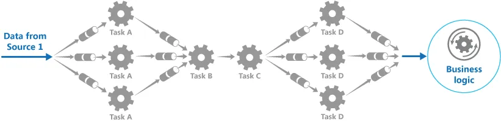

## Propriétés

### Construction

- Les filtres ne doivent pas avoir d'état.
- Ils doivent être idempotents

### Attention

- Peut avoir un impact négatif sur la fiabilité et la cohérence en raison d'intermédiaires supplémentaires.
- N'est pas adapté aux systèmes interactifs ou aux calculs de longue durée

### Avantages

- Réduit le couplage
- Augmente la cohésion
- Gère les ressources

# Question 22 Broker

Séparer les consommateurs d'un service des fournisseurs en insérant un nouveau composant appelé broker.

Le consommateur n'a aucune connaissance du fournisseur.

Le broker reçoit la demande et la transmet ensuite au fournisseur en fonction des conditions de routage internes ou externes.

Le résultat est ensuite renvoyé au broker qui le transmet à son tour au consommateur.

__Shéma du cours !!!!__

## Propriétés

### Construction

- Le broker introduit souvent un état entre le client et le service
- Requiert un contrat entre le client et le service

### Attention

- Complexité additionnelle
- Impact négatif sur les performances
- Point de défaillance unique (si le broker crash, c'est un problème...)
- Plus difficile à tester

### Avantages

- Réduit le couplage
- Diffère la liaison (Defer binding) ???
- Contrôle la demande
- Gère les ressources
- Localise le service

# Question 23 Publish-Subscribe

Introduire la messagerie asynchrone pour découpler les émetteurs et les récepteurs.

Elle garantit que l'expéditeur n'est pas bloqué jusqu'à ce que tous les consommateurs aient reçu
le message et évite aux consommateurs d'avoir à
agir pour savoir s'il y a un nouveau message.

En outre, les expéditeurs et les récepteurs ne se connaissent pas.

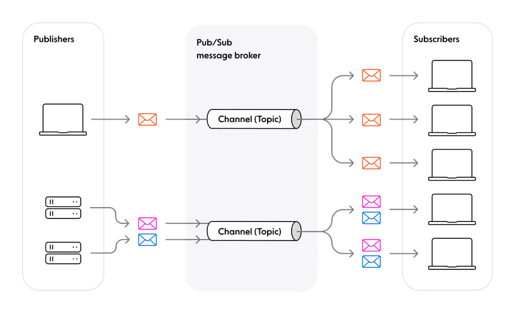

## Propriétés

### Construction

- S'appuye sur des technologies complexes (Rely on complex technologies)
- Les politiques de sécurité sont obligatoires
- La gestion des abonnements peut devenir désordonnée

### Attention

- L'ordre des messages n'est pas garanti.
- L'idempotence est nécessaire
- Un message répété peut causer des problèmes
- Expiration du message

### Avantages

- Réduit le couplage
- Augmente la cohésion
- Diffère la liaison (Defer binding)
- Gère les interfaces
- Contrôle la demande
- Gère les ressources

# Question 24 Model View Controler

(M)odel-(V)iew-(C)ontroller est destiné aux interfaces utilisateurs.

Il divise la responsabilité en 3 composants :

1. Le modèle qui contient les données et la logique commerciale de l'application.
2. La vue fournit le support visuel
3. Le contrôleur traite les entrées et les traduit en commandes pour piloter le modèle et la vue.

{width=70%}

## Propriétés

### Construction

- S'appuye sur les technologies (rely on technologies)

### Attention

- Les responsabilités sont parfois floues (Responsibilities are sometimes fuzzy)
- Modifications en cascade

### Avantages

- Réduit le couplage
- Augmente la cohésion
- Diffère la liaison (Defer binding)

# Question 25 Micro-services 

Développer un grand nombre de petits services sur une application monolithique.

Cela permet d'être beaucoup plus granulaire dans le déploiement.

Chaque élément est plus facile à tester de manière isolée.

Bien adapté aux petites équipes équipes agiles.

Enfin, il élimine l'engagement à long terme envers une technologie particulière car chaque composant peut utiliser une pile différente.

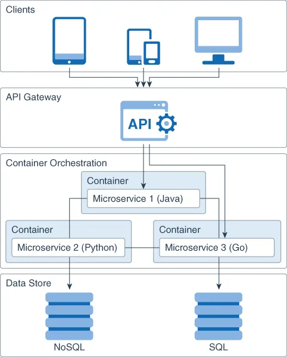{width=50%}

## Propriétés

### Construction

- S'appuie sur une multitude de technologies
- S'appuie sur de nombreux autres patterns (ex: broker)

### Attention

- Les tests d'intégration sont difficile
- Le déploiement est complexe
- Augmentation de la consommation de mémoire
- Il faut potentiellement beaucoup discuter (Potentially very chatty)

### Avantages

- Réduit la taille du module
- Réduit le couplage
- Augmente la cohésion
- Diffère les liaisons (defer binding)
- Contrôle la demande
- Localise le service
- Gère les interfaces

# Question 26 (C)ommand (Q)uery (R)esponsibility (S)egregation

L'objectif principal du CQRS est de lire et de mettre à jour les données depuis un data store.

Il reconnaît que le modèle de lecture et de traitement (dénormalisé) est souvent contradictoire avec celui optimal pour le stockage (normalisé).

L'autre avantage est la séparation claire entre l'autorisation de lecture et l'autorisation d'écriture.

Ce modèle s'adapte généralement beaucoup mieux que le fait d'avoir le même modèle pour la lecture et l'écriture.

Le modèle est cohérent à la fin.

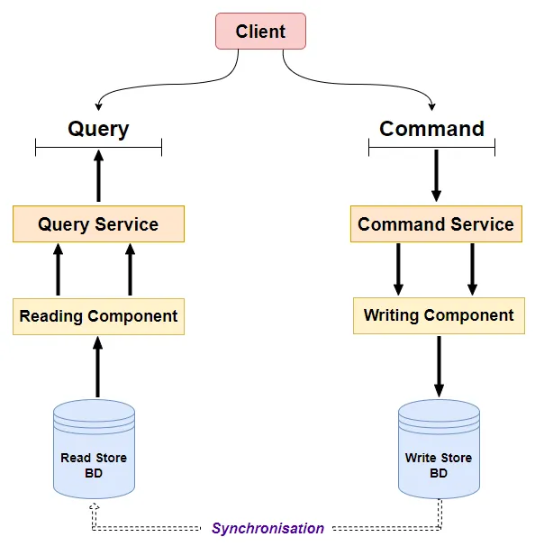{width=50%}

## Propriétés

### Construction

- S'appuie sur de nombreuses technologies
- Habituellement, la cohérence éventuelle est mise en œuvre par publishsubscribe

### Attention

- Complexité additionnelle
- La cohérence éventuelle est difficile à contrôler (Eventual consistency is difficult to control)

### Avantages

- Réduit le couplage
- Augmente la cohésion
- Contrôle la demande
- Gère les ressources

# Question 27 – qu’est ce qu’une API. Comment compare t’on API et interfaces ? Qu’est sont les bonnes pratiques. Qu’est-ce que REST API ?

- Une (A)pplication (P)rograming (I)nterface définit un contrat pour un client.
Une implémentation se conforme à cette interface mais le client ne la voit pas.

- Définit les contrats/API dès le début de la mise en œuvre
- Le faire d'abord au niveau du service et l'affiner progressivement
- Cela permet d'aider // le travail et de fixer les limites des composants.
- Accepter que les choses changent considérablement au début. Votre compréhension du problème évolue, tout comme votre API.
- Utilisez un outil pour documenter et maintenir vos API (par exemple, Javadoc, Swagger).
- Pensez comme vous voudriez l'utiliser (facile, difficile à utiliser à mauvais escient, complet)
- Ne pas abuser du chaînage de méthodes

## Conseils

- Minimiser le couplage des paquets
- Utiliser des interfaces plutôt que des classes abstraites
- Éviter les statiques, se méfier de Singleton (plus d'informations à ce sujet ultérieurement)
- Rester à l'écart des détails d'implémentation dans l'API
- Utiliser des exceptions d'exécution standard (IllegalArgument, IllegalState, ....)
- Utiliser une formulation et une forme cohérentes
- Utiliser des varargs, des enums, des valeurs par défaut
- PENSER À LA TESTABILITÉ

## REST API

Une API REST est une API qui suit les principes du (T)transfert d'état(S) (RE)présentationnel.

(REpresentational State Transfert)

Il s'agit d'un ensemble de contraintes auxquelles les services web doivent se conformer.

Ils permettent la scalability, la portabilité, la fiabilité et la modifiabilité.

### Propriétés

1. Client-Serveur : séparation de l'interface utilisateur et de la commande.
L'état de la session est conservé du côté client. Supposons un système déconnecté. (Assume a disconnected system)
2. Statelessness : chaque requête du client au serveur doit être autonome.
3. Mise en cache : si une réponse ne peut être mise en cache (idempotence), elle doit être explicite.
4. Interface uniforme : identification des ressources, manipulation des ressources par le biais de la représentation, du message auto-descriptif et des liens hypertextes comme moteur. (ou et de l'interface de communication... En anglais: and hyperlinks as the engine.
5. Système en couches : voir les modèles d'architecture
6. Code à la demande (facultatif) : le serveur peut renvoyer de la logique (telle que JavaScript).

### Guidelines

- Ressource : information qui peut être nommée avec un identifiant de ressource.
Utilisez des noms pluriels et non des verbes. Exemple:
/employees/123 : employé avec l'identifiant 123
- Représentation de la ressource : une représentation se compose de données, de métadonnées et d'hyperliens qui permettent au client de naviguer entre les différents états.
Généralement, JSON ou XML
- Méthodes de la ressource : opérations qui permettent de passer d'un état à l'autre.
En général, elles reposent sur les méthodes HTTP (GET, PUT, POST, DELETE). Exemple:
POST employees/123 (avec un corps en json ou en xml) crée l'employé 123

- Utiliser des noms au pluriel et non des verbes : /employees et non /getEmployees
- Utiliser les paramètres pour configurer le service MAIS PAS pour identifier les ressources

    /employees/1 et non /employees?id=1 MAIS /employees?name=XX
et non /getEmployeeByName/XXXX

- Utiliser le bon code de retour HTTP : par exemple, 201 comme code de retour pour une ressource nouvellement créée et non 200
- Utiliser le versioning /v1/employees, /v2/employees
- Utiliser la pagination comme paramètre : /employees?limit=25&offset=50
- Utiliser la spécification OpenAPI : https://swagger.io/resources/open-api/

# Question 28 – Qu’est ce que sont les qualités externes et internes ? Quelle est la différence entre vérification et validation.

## Qualités externes

Ce que perçoivent les parties prenantes en dehors de l'équipe de développement

### Fonctionnel (difficile à spécifier et à vérifier)

- Validité par rapport aux exigences de l'utilisateur

### Non fonctionnel (généralement plus facile à vérifier)

- Performances : scalabilité, débit (throughput)
- Facilité d'utilisation : facile à comprendre, rapide à utiliser
- Réutilisation : les parties peuvent-elles être réutilisées pour d'autres logiciels ?
- Portabilité : est-il polyvalent du point de vue de la plate-forme ?
- Interopérabilité : s'intègre-t-il facilement avec des tiers ?
- Robustesse : Est-il résistant lorsqu'il est confronté à des comportements inattendus ?
 
## Qualités internes

Ce que l'équipe de développement perçoit du logiciel

### Fonctionnel

- Conformité aux spécifications

### Non fonctionnel

- Vérifiabilité : Le logiciel est-il facilement testable ?
- Maintenabilité : l'ajout d'une nouvelle fonctionnalité ou la correction d'un bug ne nécessite pas une énorme préparation

## Assurance qualité

L'assurance qualité est le résultat de plusieurs activités :

- Test : Exercer le logiciel pour vérifier s'il se comporte correctement par rapport aux spécifications ou aux exigences de l'utilisateur.
- Vérification du modèle : Vérifier qu'un modèle du logiciel respecte des propriétés spécifiques
- Code Review/Audit : Regarder le code jusqu'à ce que vous puissiez lire la matrice
- En suivant les bonnes pratiques/modèles connus : Se tenir sur les épaules des géants

## V&V

Évaluer que le logiciel produit respecte la spécification n'est pas la même chose que de vérifier qu'il satisfait les besoins de l'utilisateur.

### Validation

Avons-nous construit le bon logiciel (par rapport aux besoins de l'utilisateur) ?

(Did we built the right software)

### Vérification

Avons-nous bien construit le logiciel (par rapport à la spécification) ?

(Did we built the software right)

# Question 29 – Représentez la pyramide des tests et commentez.

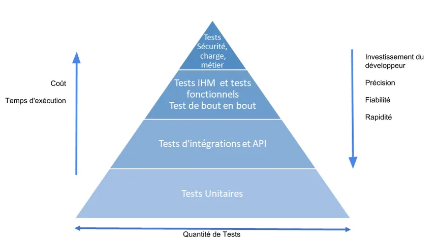

Incomplet... Regarder dans le cours p146

## Test : Vocabulaire

- Objectif de test (Test objective) : ce qu'il faut tester (fonctionnalité, NFR)
- Cas de test (Test case): vérifie un objectif de test et consiste en un ensemble de valeurs d'entrée, de pré-conditions, de résultats attendus et de post-conditions.
- Procédure de test (Test procedure): procédure permettant de mettre en place, d'exécuter et d'évaluer le résultat d'une séquence de cas de test.
- Plan de test (Test plan): description de la portée, de l'approche, des ressources et du calendrier des activités de test.

## Test

Les tests comprennent les activités suivantes :

- Planification et contrôle des tests
- Analyse et conception des tests
- Mise en œuvre et exécution des tests
- Évaluation des critères de sortie et établissement de rapports
- Activités de clôture des tests

### Planification et contrôle des tests

- Définition des objectifs du test
- Planification de haut niveau (high-level scheduling)
- Contrôle et signalement des écarts (Control and reporting of deviations)

### Analyse et conception des tests

- Transformer les conditions générales d'essai en cas d'essai réels :
    - Mettre en place l'architecture de test
- Concevoir des cas de test de haut niveau 

### Mise en œuvre et exécution des tests

- Priorité à la mise en œuvre des cas de test
- Création d'une procédure de test
- Création d'un test harness (environnement)
- Vérifier la traçabilité bidirectionnelle

- Exécution de la procédure de test
- Enregistrement des résultats
- Comparer les résultats réels et les résultats attendus
- Signaler l'échec et remonter à la cause de l'échec (trace back the reason)
- Répéter l'exécution pour vérifier que l'erreur a été corrigée.

## Principes des tests

- Les tests prouvent la présence de défauts.
- Les tests ne prouvent pas l'absence de défauts (voir principe 2).
- Les tests exhaustifs (test de toutes les combinaisons d'entrées et de sorties) ne sont pas réalisables dans les cas non triviaux.
- Plus les tests sont effectués tôt, mieux c'est.
- Étudier la densité des défauts. Les tests doivent se concentrer sur les modules dont la densité de défauts attendus/mesurés est élevée
- Les tests ne vieillissent pas bien.
En d'autres termes, les tests doivent être revus régulièrement pour évaluer leur validité
- Les tests ne sont pas effectués de la même manière dans les applications critiques pour la sécurité et dans les sites web de commerce électronique.
N'oubliez pas d'évaluer les risques et les enjeux.
- L'absence de défaut ne signifie pas que le système est prêt pour le prime time.
Cela signifie qu'il remplit (en partie) les spécifications, mais pas nécessairement les exigences de l'utilisateur.

## Niveaux de test

### Tests de composants

- alias test d'unité, test de module
- Base de test : Exigences des composants, conception détaillée, code
- Objets du test : Composants (classes, package, programmes, scripts de base de données, ...)

- En isolation
- Utilise des mock, des stubs, des fakes
- Teste les exigences fonctionnelles et non fonctionnelles
- Par les programmeurs (peu de frais de gestion)

### Tests d'intégration

- Base de test : architecture et conception, use case, flux de travail
- Objets de test : Ensemble de composants, sous-systèmes, infrastructure, configuration du système, intégration aux composants externes

- Il peut rester des mocks
- Se fait après le test des composants
- L'intégration de trop de choses peut nuire à la traçabilité
- Fait par le responsable de l'intégration/le développeur

### Test du système

- Base de test : Exigences du système, cas d'utilisation, analyse des risques
- Objets de test : Système dans son ensemble, documentation, aide, configuration
- Plus de mocks
- Après les tests d'intégration
- L'environnement de test doit être aussi proche que possible de l'environnement de production
- Généralement effectué par une équipe différente (pas de développeur)

### Test d'acceptation par l'utilisateur

- Base de test : exigences de l'utilisateur, exigences du système, cas d'utilisation, processus opérationnels, analyse des risques
- Objets de test : procédures utilisateur, formulaires, rapports, configuration
- Plus de mocks
- Après les tests du système
- objectif : établir la confiance nécessaire pour prendre une décision éclairée sur la question de savoir si l'on va ou non valider le logiciel
- Fait par l'utilisateur final

## Types de tests

- Fonctionnels
- Structure/Architecture
- Non fonctionnels
- Liés au changement

## Test techniques
- White box
- Black box
- Static
    - Review/Audit
    - Static analysis
- Dynamic
    - White box
    - Black box
    - Code coverage

# Question 30 – Que sont les tests doubles ? Donnez en la liste et commentez sur les différences d’usage.

## Tests de composants

alias tests unitaires, tests de modules

- Base de test : Exigences du composant, conception, code
- Objets du test : Composants (classes, package, programmes, scripts de base de données, ...)

### En isolation

- Utilise des mocks, des stubs, des fakes
- Teste les exigences fonctionnelles et non fonctionnelles
- Par les programmeurs (faible coût de gestion)

## Test double

Aide à améliorer l'isolation des tests

Sinon, il ne s'agirait pas d'un test de composant (unité)

De nombreux types de test doubles pour de nombreux usages différents

p171: shéma

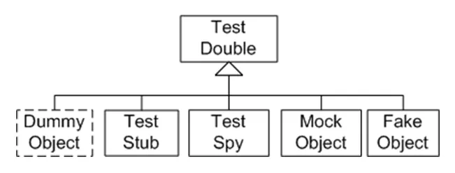

### Dummy objects

Pour satisfaire aux contrôles au moment de la compilation

Pour les exécutions au moment de l'exécution (for runtime executions)

Le paramètre delta de la fonction doBusiness peut être fixé à
null

### Test doubles - Fake

Shéma ?

### Test doubles - Test stub

Shéma ?

### Test doubles - Mock

Shéma ?

### Test doubles - Test spy

Shéma ?

# Question 31 – Qu’est ce qui favorise la productivité dans le software développent

## Règles

- Règle 1 : ne pas faire de choses ennuyeuses $\Rightarrow$ Tout automatiser
- Règle 2 : ne faites pas confiance à votre code $\Rightarrow$ Testez tout
- Règle 3 : être professionnel $\Rightarrow$ Utiliser le bon outil pour la tâche à accomplir
- Règle 4 : être paresseux $\Rightarrow$ Réutiliser autant que possible les bibliothèques existantes
- Règle 5 : se remettre en question $\Rightarrow$ mesurer la productivité et la qualité
- Règle 6 : la qualité d'un plan dépend de son exécution $\Rightarrow$ Assurer un suivi
 
## Indicateur clé de performance de la productivité

Un bon indicateur est

- Cohérente : utiliser des définitions claires pour que les chiffres aient un sens.
- vérifiable : les personnes extérieures peuvent prouver la viabilité des mesures
- Disponibles : ils peuvent être utilisés pour l'étalonnage des performances.
- Répétable : différents groupes d'utilisateurs obtiendront essentiellement le même chiffre.

# Points d'histoire

L'estimation par heures ou par jours est généralement très imprécise et dépend beaucoup du fait que tout ce qui concerne la fonctionnalité est connu à l'avance (conception, problèmes techniques).

Elle suppose aussi souvent que l'effort est linéaire.

- Les points d'histoire évaluent l'effort sur une échelle de Fibonacci : 1, 2, 3, 5, 8, 13, 20, 40, 100.
Cela oblige l'équipe à être plus réaliste quant à la difficulté d'une tâche.

- Les jours ne tiennent pas compte du travail non lié au projet qui s'insinue inévitablement dans nos journées : les courriels, les réunions et les entretiens auxquels un membre de l'équipe peut participer.

- Les jours sont liés à des émotions. L'estimation relative supprime cet attachement émotionnel.

- Chaque équipe estimera le travail sur une échelle légèrement différente, ce qui signifie que leur vitesse (mesurée en points) sera naturellement différente.
Il est donc impossible de faire de la politique en utilisant la vélocité comme une arme.

- Une fois que vous vous êtes mis d'accord sur l'effort relatif de chaque valeur de story point, vous pouvez attribuer des points rapidement, sans trop de débats.

- Les story points récompensent les membres de l'équipe pour la résolution de problèmes en fonction de la difficulté, et non du temps passé.
Cela permet aux membres de l'équipe de se concentrer sur la valeur ajoutée, et non sur le temps passé.

# Question 32 – Expliquez comment fonctionne un burndown chart

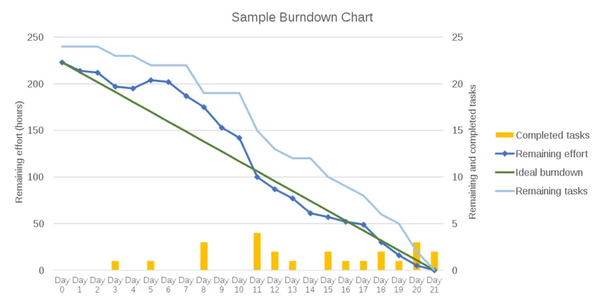

## Paramètres supplémentaires pour mesurer la productivité de l'équipe

- Engagé (Committed) : Le nombre de points d'histoire qu'une équipe pense pouvoir livrer dans les limites d'une équipe.
- Terminé (Completed): Le nombre de points d'histoire qu'une équipe a effectivement livrés au cours du sprint
- Prévisibilité : terminé vs engagé (completed vs committed)
- Vélocité : habituellement mesurée en story points.
Il s'agit de la "quantité" de travail qu'une équipe peut fournir au cours d'un sprint.
Aide à planifier les sprints suivants sur la base des performances réelles mesurées précédemment.
Cela ne fonctionne que si la quantité de travail décrite par un story point reste constante (même équipe)
- Rendement (throughput): mesure la quantité de travail exprimée en unités de travail (tickets, fonctionnalités, histoires, ...).
Aide à détecter une équipe qui est bloquée.

La vélocité est meilleure pour le développement de logiciels, tandis que le rendement (throughput) est meilleur pour les équipes de support.

## Mesures supplémentaires pour mesurer la qualité de l'équipe

- Mesure du temps de cycle : temps total entre le moment où un ticket est accepté par un développeur et le moment où il est livré selon sa définition de "done".
- Régression : bugs sur des fonctionnalités qui fonctionnaient auparavant, ou bugs qui étaient corrigés auparavant.
- MTTR : Mean Time To Remediation (temps moyen de remédiation) indique la rapidité avec laquelle vous pouvez déployer des correctifs pour les consommateurs après avoir été informés de l'existence d'un défaut.
- Couverture du code (code coverage) : la quantité de code mesurée en ligne de code qui est couverte par un test unitaire (et par extension tous les tests unitaires).
- Taux de bogues : le nombre moyen de bogues créés au fur et à mesure que de nouveaux éléments sont créés.
Il peut vous aider à estimer si vous produisez de la valeur ou si vous ne faites que déployer un code en demi-teinte.

    Produisez-vous de la qualité ou simplement de la quantité ?

- Défaut échappé : un défaut qui n'a pas été trouvé par l'équipe d'assurance qualité.
Généralement, ces problèmes sont découverts par les utilisateurs finaux après que la version publiée a été mise à leur disposition.

 
# Question 33 – Qu’est-ce qu’une software factory ? Donnez-en une description des composants
 
Shéma p218

## Integrated Development Environment (IDE)

- Fournit un ensemble d'outils faciles à utiliser afin de maximiser la productivité du développement.
- Édition de code : mise en évidence de la syntaxe, complétion du code, remaniement.
- Compiler et construire : compile le code source en binaires et construit des paquets déployables.
- Exécuter, déboguer et tester : exécute des tests unitaires ou un programme complet et fournit des capacités de débogage faciles.
CONSEIL : prenez le temps d'apprendre les touches de raccourci par cœur.

## Gestion du code source

- Sauvegarde des versions du code source
- Possibilité de revenir à une version particulière
- Permettre de comparer facilement les versions du code
- Pour éviter/réduire les conflits entre les versions, il existe deux approches :
    - Le verrouillage pessimiste et le verrouillage optimiste.
- Gérer les balises et les branches du code

## Vocabulaire de la gestion du code source

- Tag/label : une sauvegarde en lecture seule de l'état du code à un moment donné.
- Branche : un ensemble de fichiers dans une version particulière qui ont été forkés à un moment donné à partir d'une autre branche.
- Révision/Version : l'état atomiquement cohérent du code source. Elle est généralement identifiée de manière unique.
- Checkout (extraction) : Créer une copie à partir d'un dépôt à un moment donné.
- Commit (nom) est une modification associée à une révision et commit (verbe) est l'action d'écrire ou de fusionner des modifications.
Un commit ainsi que les changements dans le code source contiennent des métadonnées telles que
les auteurs, le message de validation...
- Clone : copie d'un référentiel complet avec tout l'historique.
- Fetch/Pull : copie d'une révision d'un dépôt (par exemple, distant) vers un autre (par exemple, local).
- Head : La pointe de l'historique. Pointe vers le commit le plus récent
- Fusionner (merge) : Intégrer différentes modifications (commits) et résoudre les conflits potentiels.
- Pousser (push): copier une ou plusieurs révisions d'un dépôt (par exemple, local) vers un autre (par exemple, distant).
- Pull Request (demande d'extraction) : Une demande de fusion de révisions

### Branchements

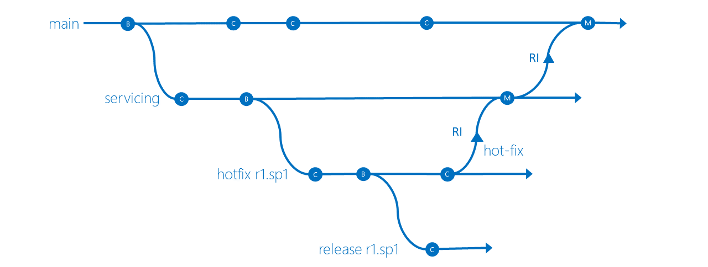

## Outil de construction et de gestion des dépendances

- Automatisation des différentes étapes de construction d'un logiciel
- Gestion des dépendances et des dépendances transitives
- Le même outil et la même configuration pour construire le logiciel quel que soit l'endroit où il doit être construit (ordinateur portable de développement ou serveur CI).
- Systématique et reproductible

Exemple p224

## Outil d'intégration continue

- Compiler et exécuter localement
- Compiler et exécuter la version mergée (intégrée) du code
- Pour éviter l'effet "Dunno, works on my machine (shrug)", la compilation locale et la compilation sur le serveur CI DOIVENT ÊTRE IDENTIQUES.
- Chaque commit doit être testée de manière centralisée
- Chaque commit est accompagnée d'un cas de test
- Le build doit être rapide (<15min) pour le commit build
- La dernière version doit être facilement testable à n'importe quel moment.
- Les portes de qualité (couverture < 80%, nombre d'odeurs de code) font échouer la construction.

## Outil de gestion des artefacts

- Les binaires doivent être facilement accessibles par les outils de gestion des dépendances
- Les binaires doivent être signés
- Les binaires sont identifiés de manière unique

## Conseils de productivité

- Automatisez, automatisez, automatisez, automatisez, ... (apprenez le shell/vi, sérieusement !)
- Minimisez les distractions. Prévoyez un horaire pour vérifier les courriels, le téléphone, les chats.
- Trouvez l'environnement de travail idéal pour VOUS.
- Connaissez-vous vous-même. Êtes-vous plutôt du genre à commencer tôt ou à travailler tard ?
- Luttez contre le syndrome de Stockholm ! N'acceptez pas une productivité médiocre !
- Refactoriser continuellement et éviter de refactoriser en rafale.
- Ayez toujours le bon environnement pour tester.
- Apprenez vos outils et revisitez-les régulièrement.

# Question 34 – Qu’est-ce qu’une branching strategy ? Expliquez les différents types de branches.

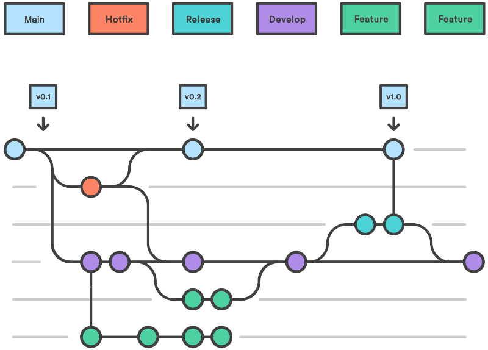

## develop

Développement

- Pas de commits de développement.
- Sert de branche d'intégration pour différentes fonctionnalités. Fournit l'historique complet du projet.
- Toutes les branches de fonctionnalités sont fusionnées dans cette branche.

## feature

Développement

- Branche séparée pour chaque fonctionnalité. Branchée à partir de la branche "développement".
- Elle ne doit pas interagir directement avec la branche "master".
- Lorsque le développement est terminé, la branche "développement" est fusionnée avec la branche "master". 

## hotfix

Développement

- Ces branches sont utilisées pour corriger rapidement les versions de production.
- C'est la SEULE branche qui doit être directement dérivée de la branche "master".
- Lorsque le développement est terminé, il doit être fusionné dans la branche "master" ainsi que dans la dernière branche "develop".
- La branche "master" doit être étiquetée avec le numéro de version approprié lorsque le correctif est publié.

## master

Mainline

- Aucun commit de développement.
- Fournit l'historique officiel des versions du projet.

## release

Release

- Une fois que toutes les fonctionnalités (qui font partie d'une release) sont terminées et fusionnées dans la branche "development", une branche "release" sera créée à partir de la branche "development".
- AUCUNE NOUVELLE FONCTIONNALITÉ N'EST AUTORISÉE DANS LA BRANCHE "RELEASE".
- Seules les corrections de bogues, la documentation et les autres tâches liées à la version (telles que les tests de régression et les tests de performance)
- Une fois que tout est terminé et prêt à être expédié, la branche "release est fusionnée dans "master" et étiquetée avec une version release.
- Cette branche doit également être fusionnée avec la branche "develop".

# Question 35 – Qu’est ce que la dette technique ? Comment la détecter, la suivre. Est-ce bon ou mauvais ?
 
# Question 36 – Décrivez un processus de sécurité. Qu’est ce STRIDE ? Quels sont les éléments d’une politique de sécurité.
