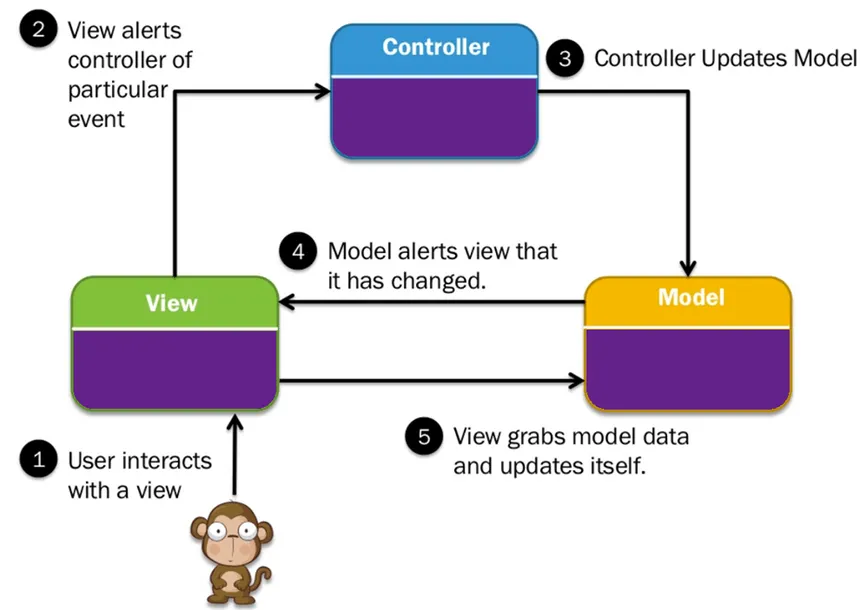

# Question 15 - Quelles sont les différentes activités du cycle de développement. Sélectionnez l'une d'elles et expliquez-la en détail. A quoi faut-il faire attention.

- Requirements: Détermine les besoins du client
- Design: Définit les spécifications et la structure du logiciel (peut être découpé en high-level design (architecture) et en design détailé)
- Implementation: création du logiciel (code, configuration)
- Testing: évaluer si le logiciel répond aux spécifications et aux attentes du client
- Maintenance: une fois en production, améliorer le logiciel et s'assurer qu'il reste opérationnel
 
# Question 16 – Quels sont les différentes catégories de requirements – Expliquez comment on peut les formaliser. Prenez l’un des formalismes et expliquez-le en détail.

Le besoin qu'une partie prenante cherche à satisfaire.

Attention : TRÈS SOUVENT, on mélange le besoin et la solution pour le satisfaire.

## Catégories de requirements

- Fonctionnel
    - validité
- Non-fonctionnel
    - Performances : scalabilité, débit (throughput)
    - Facilité d'utilisation : facile à comprendre, rapide à utiliser
    - Réutilisation : les éléments peuvent-ils être réutilisés pour d'autres logiciels ?
    - Portabilité : est-il polyvalent du point de vue de la plate-forme ?
    - Interopérabilité : s'intègre-t-il facilement avec des tiers ?
    - Robustesse : Est-il résistant lorsqu'il est confronté à des comportements inattendus ?

## Qualité des requirements

1. Unitaire : les exigences répondent à 1 et 1 seul besoin
2. Complétude : les exigences sont globales
3. Cohérence : les exigences ne vont pas à l'encontre d'autres exigences
4. Traçabilité : l'exigence est correctement documentée et vérifiée.
5. Actualité : les exigences sont à jour. Dans le cas contraire, cela conduit à un glissement du champ d'application.
6. Sans ambiguïté : les exigences sont exemptes de jargon technique et sont suffisamment documentées pour ne pas nécessiter de connaissances supplémentaires pour les interpréter.
7. Priorité : les exigences sont correctement hiérarchisées afin d'optimiser les ressources.
8. Vérifiable : la mise en œuvre de l'exigence peut être vérifiée et il existe un moyen clair de valider si elle a été correctement mise en œuvre.

## Capturer les requirements ?

1. Haut niveau
    - Document vision
    - Learn Canvas
2. Détaillé
    - User stories or use case
        - User storie: As a < type of user >, I want to < some goal > so that <
reason to achieve the goal >
        - use case: Décrit les interactions entre un rôle, c'est-à-dire un acteur, et le système, afin d'atteindre les objectifs fixés.
    - storyboards: Raconter une histoire à l'aide d'une séquence de dessins/croquis/images
    - non-fonctionnel: définit la manière dont le système fonctionne et NON ce qu'il fait. Également appelés attributs de qualité

### requirements non fonctionnels

Execution quality attributes

- security, usability, performance (throughput, response time), fault tolerance, high availability, auditability….

Availability

- Evolution quality attributes
- Maintainability, testability, interoperability, performance (scalability)

# Question 17 – Quels sont les différentes approches de gestion du cycle de développement ? Comparez deux d’entre-elles.
 
- Waterfall
- V-Cycle
- Iterative and Incremental
- Agile

## Waterfall

- Découpage linéaire des activités
- Fonctionne bien dans un environnement très structuré et stable
- Simple à comprendre et à appliquer
- Le développement de logiciels évolue rapidement

## V-Cycle

- Évolution du modèle waterfall
- Chaque étape du droit correspond à la vérification et la validation de l'étape de gauche.

## Iterative and incremental

- Développer un logiciel par le biais de cycles répétés (itératifs) et par petits morceaux (incrémental).
- Le client est impliqué dans chaque étape
- Rational Unified Process est l'implémentation la plus connue.

{width=70%}

### Rational Unified Process

RUP consiste à donner la priorité à la chose la plus risquée

- Inception : phase la plus courte
- Élaboration : traiter les facteurs de risque connus
- Construction : phase la plus longue, développement
- Transition : obtenir l'avis des utilisateurs

## Agile

Il ne s'agit pas d'un processus de développement mais plutôt d'un état d'esprit

- Les individus et les interactions plutôt que les processus et les outils
- Un logiciel fonctionnel plutôt qu'une documentation complète
- La collaboration avec le client plutôt que la négociation d'un contrat
- Répondre au changement plutôt que suivre un plan

### Manifeste Agile

- Accueillir les exigences changeantes, même à un stade avancé du développement. Les processus agiles exploitent le changement pour l'avantage concurrentiel du client.
- Livrer un logiciel fonctionnel fréquemment, de quelques semaines à quelques mois, avec une préférence pour les délais les plus courts.
- Les commerciaux et les développeurs doivent travailler ensemble quotidiennement tout au long du projet.
- Construire des projets autour d'individus motivés. Donnez-leur l'environnement et le soutien dont ils ont besoin et faites-leur confiance pour faire le travail.
- La méthode la plus efficace pour transmettre des informations à une équipe de développement et au sein de celle-ci est la conversation en face à face.
- Le logiciel fonctionnel est la principale mesure du progrès.
- Les processus agiles favorisent le développement durable. Les commanditaires, les développeurs et les utilisateurs devraient être en mesure de maintenir un rythme constant indéfiniment.
- L'attention constante portée à l'excellence technique et à la qualité de la conception renforce l'agilité.
- La simplicité - l'art de maximiser la quantité de travail non effectué - est essentielle.
- Les meilleures architectures, exigences et conceptions émergent d'équipes auto-organisées.
- À intervalles réguliers, l'équipe réfléchit à la manière de devenir plus efficace, puis ajuste son comportement en conséquence

# Question 18 – Citez 5 principes de software engineering. Comparez deux d’entre-eux.

L'architecture logicielle décrit les éléments constitutifs d'un système logiciel
et leurs relations ainsi que les interactions avec les éléments externes.
L'idée est de projeter les systèmes selon différentes vues pour les décrire.

## The Conway’s Law

Toute organisation qui conçoit un système (défini au sens large) produira une conception dont la structure est une copie de la communication de l'organisation.

## SOLID

### Principe de responsabilité unique (Single-responsibility principle)

- Une classe ne doit avoir qu'une seule responsabilité, c'est-à-dire que seuls les changements apportés à une partie de la spécification du logiciel doivent pouvoir affecter la spécification de la classe.

### Principe d'ouverture et de fermeture (Open–closed principle)

- Les entités logicielles ... doivent être ouvertes à l'extension, mais fermées à la modification.

### Principe de substitution de Liskov

- Les objets d'un programme doivent pouvoir être remplacés par des instances de leurs sous-types sans que cela n'altère la correction du programme.

### Principe de ségrégation des interfaces (Interface segregation principle)

- Plusieurs interfaces spécifiques au client valent mieux qu'une seule interface à usage général.

### Principe d'inversion de la dépendance (Dependency inversion principle)

- Il faut "dépendre des abstractions, [et non] des concrétions".

## YAGNI

Le principe "You aren't gonna need it" (YAGNI) est un principe de la programmation extrême (XP) qui stipule qu'un programmeur ne doit ajouter des fonctionnalités que si elles sont jugées nécessaires.

Le cofondateur de XP, Ron Jeffries, a écrit : "Implémentez toujours les choses lorsque vous en avez réellement besoin, jamais lorsque vous prévoyez qu'elles seront nécessaires".

## KISS

KISS, acronyme de "keep it simple,
stupid" ou "keep it stupid simple", est un
principe de conception énoncé par la marine américaine
américaine en 1960.

Le principe KISS stipule que la plupart des systèmes
fonctionnent mieux s'ils sont simples que s'ils sont compliqués.
Par conséquent, la simplicité doit être un objectif clé de la conception et la complexité inutile doit être évitée.

## Law of Demeter
 
Principe de moindre connaissance (least knowledge)

- Chaque unité ne doit avoir qu'une connaissance limitée des autres unités : seulement les unités "étroitement" liées à l'unité actuelle.
- Chaque unité ne doit parler qu'à ses amis ; ne pas parler à des étrangers.
- Ne parlez qu'à vos amis immédiats.

Le respect de ce principe favorise la maintenabilité, mais s'il est utilisé de manière abusive, il conduit à la création d'un grand nombre de wrappers inutiles.

# Question 19 – Qu’elles sont les étapes de création d’une architecture ?

- Vue logique : il s'agit d'une vue statique ou instantanée du système. (diagramme de classe, diagramme d'état)
- Vue du processus : il s'agit d'une vue dynamique du système, qui décrit le comportement en cours d'exécution (diagramme de séquence, diagramme d'activité).
- Vue du développement : décrit le point de vue de l'équipe de développement, explique comment les composants interagissent et sont assemblés (diagrammes de composants et de paquets)
- Vue physique : comment le système est déployé physiquement sur le matériel
(diagrammes de déploiement)
- Scénarios : donne une compréhension de haut niveau de l'objectif du système (cas d'utilisation)
 
# Question 20-26 Quels sont les patterns d’architecture qui implémentent les tactiques : increase cohesion, reduce coupling, manage resources, defer binding, control demand, locate services

## A quoi sert l’architecture pattern ?

## Faire un diagramme pour expliquer son fonctionnement

## A quoi faut-il faire attentions ?

# Tactics (TODO !!!)

# Question 20 Layered

Le modèle d'architecture en couches définit une séquence de couches.

Chaque composant est associé à exactement à une couche et __aucune couche inférieure ne peut appeler une couche supérieure__.

Le contrat entre chaque couche est clairement défini et il est donc facile de remplacer une couche par une autre.

{width=70%}

## Propriétés

### Construction

- Au moins 2 layers
- Chaque composante est dans exactement 1 layer
- Aucun layer inférieur peut appeler un layer supérieur

### Attention

- Complexité additionnelle
- Impact négatif sur la performance

### Avantages

- Réduit le couplage
- Augmente la cohésion

# Question 21 Pipe and filters

Définit une séquence de transformation de flux de données.

Les données sont consommées par un par un filtre via son port d'entrée, sont transformées, puis transmises par un pipe vers le filtre suivant.

Un filtre peut consommer à partir de et vers plusieurs pipes.

## Propriétés

### Construction

- Les filtres ne doivent pas avoir d'état.
- Ils doivent être idempotents

### Attention

- Peut avoir un impact négatif sur la fiabilité et la cohérence en raison d'intermédiaires supplémentaires.
- N'est pas adapté aux systèmes interactifs ou aux calculs de longue durée

### Avantages

- Réduit le couplage
- Augmente la cohésion
- Gère les ressources

# Question 22 Broker

Séparer les consommateurs d'un service des fournisseurs en insérant un nouveau composant appelé broker.

Le consommateur n'a aucune connaissance du fournisseur.

Le broker reçoit la demande et la transmet ensuite au fournisseur en fonction des conditions de routage internes ou externes.

Le résultat est ensuite renvoyé au broker qui le transmet à son tour au consommateur.

__Shéma du cours !!!!__

## Propriétés

### Construction

- Le broker introduit souvent un état entre le client et le service
- Requiert un contrat entre le client et le service

### Attention

- Complexité additionnelle
- Impact négatif sur les performances
- Point de défaillance unique (si le broker crash, c'est un problème...)
- Plus difficile à tester

### Avantages

- Réduit le couplage
- Diffère la liaison (Defer binding) ???
- Contrôle la demande
- Gère les ressources
- Localise le service

# Question 23 Publish-Subscribe

Introduire la messagerie asynchrone pour découpler les émetteurs et les récepteurs.

Elle garantit que l'expéditeur n'est pas bloqué jusqu'à ce que tous les consommateurs aient reçu
le message et évite aux consommateurs d'avoir à
agir pour savoir s'il y a un nouveau message.

En outre, les expéditeurs et les récepteurs ne se connaissent pas.

## Propriétés

### Construction

- S'appuye sur des technologies complexes (Rely on complex technologies)
- Les politiques de sécurité sont obligatoires
- La gestion des abonnements peut devenir désordonnée

### Attention

- L'ordre des messages n'est pas garanti.
- L'idempotence est nécessaire
- Un message répété peut causer des problèmes
- Expiration du message

### Avantages

- Réduit le couplage
- Augmente la cohésion
- Diffère la liaison (Defer binding)
- Gère les interfaces
- Contrôle la demande
- Gère les ressources

# Question 24 Model View Controler

(M)odel-(V)iew-(C)ontroller est destiné aux interfaces utilisateurs.

Il divise la responsabilité en 3 composants :

1. Le modèle qui contient les données et la logique commerciale de l'application.
2. La vue fournit le support visuel
3. Le contrôleur traite les entrées et les traduit en commandes pour piloter le modèle et la vue.

{width=70%}

## Propriétés

### Construction

- S'appuye sur les technologies (rely on technologies)

### Attention

- Les responsabilités sont parfois floues (Responsibilities are sometimes fuzzy)
- Modifications en cascade

### Avantages

- Réduit le couplage
- Augmente la cohésion
- Diffère la liaison (Defer binding)

# Question 25 

## Propriétés

### Construction

### Attention

### Avantages

# Question 20 Layered

## Propriétés

### Construction

### Attention

### Avantages

# Question 27 – qu’est ce qu’une API. Comment compare t’on API et interfaces ? Qu’est sont les bonnes pratiques. Qu’est-ce que REST API ?
 
# Question 28 – Qu’est ce que sont les qualités externes et internes ? Quelle est la différence entre vérification et validation.
 
# Question 29 – Représentez la pyramide des tests et commentez.
 
# Question 30 – Que sont les tests doubles ? Donnez en la liste et commentez sur les différences d’usage.
 
# Question 31 – Qu’est ce qui favorise la productivité dans le software développent
 
# Question 32 – Expliquez comment fonctionne un burndown chart
 
# Question 33 – Qu’est-ce qu’une software factory ? Donnez-en une description des composants
 
# Question 34 – Qu’est-ce qu’une branching strategy ? Expliquez les différents types de branches.
 
# Question 35 – Qu’est ce que la dette technique ? Comment la détecter, la suivre. Est-ce bon ou mauvais ?
 
# Question 36 – Décrivez un processus de sécurité. Qu’est ce STRIDE ? Quels sont les éléments d’une politique de sécurité.
